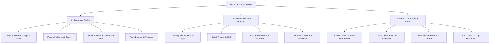

# Dokumen Panduan & Master Prompt Redesign UI Komsos SMTB

Dokumen ini berisi arsitektur UI/UX lengkap dan **Master Prompting** yang dirancang khusus untuk mereorganisasi dan memandu **Antigravity AI Agent** dalam mendesain ulang (re-design) seluruh antarmuka antarmuka sistem **Komsos SMTB** yang mencakup 3 segmen besar:
1. **Company Profile (Digital Ministry Studio)**
2. **E-Commerce (Toko Rohani Paroki)**
3. **Admin Dashboard & CRM (Management & Analytics)**

---

## 🎨 Konsep & Direction Design System

* **Mood & Visual Theme:** *Clean, Warm & Elegant Spiritual*
  * Perpaduan warna bersih (clean white/cream `#FAFAFA`, warm gold `#D97706`, soft slate `#334155`, dan sage green/sacred blue aksen).
  * Memberikan kesan hangat, ramah, terpercaya, teratur, dan religius modern.
* **Layout Structure:**
  * Responsif (Mobile-first & Desktop Dashboard).
  * Micro-interactions halus (hover card subtle, smooth page transition).

---

## 🏛️ Arsitektur 3 Segmen Utama



---

## 🚀 MASTER PROMPT (Salin Prompt Di Bawah Ini untuk AI Agent)

```text
Tolong lakukan Redesign UI/UX secara komprehensif untuk seluruh antarmuka sistem Komsos SMTB. 
Sistem ini terdiri dari 3 segmen besar yang harus terintegrasi secara seamless:

1. COMPANY PROFILE (Digital Ministry Studio):
   - Hero Section: Showreel video/media banner sinematik, statistik jangkauan media, dan CTA utama.
   - Portofolio Konten: Grid karya (Video, Desain Visual, Artikel, Podcast) dengan filter interaktif.
   - Hub Katekese: Pusat unduhan gratis modul PDF & literatur digital dengan tampilan clean.
   - Form Liputan & Volunteer: Form pengajuan peliputan acara lingkungan dan pendaftaran kontributor tim.

2. E-COMMERCE (Toko Rohani Paroki):
   - Katalog Produk: Tampilan etalase modern dipisahkan antara Produk Fisik (Rosario, Kaos) dan Produk Digital (E-Book PDF, Audio MP3).
   - Cart & Checkout: Drawer/Modal keranjang belanja interaktif dengan input kode promo (validasi 5 tahap), kalkulasi diskon otomatis, dan integrasi pembayaran Midtrans.

3. ADMIN DASHBOARD & CRM SYSTEM (Khusus Pengelola):
   - Dashboard Analitik: Ringkasan total penjualan, grafik pesanan, statistik download katekese, dan traffic konten.
   - CMS Konten & Produk: Form CRUD produk, stok, harga, modul katekese, dan pembuatan kode promo.
   - Manajemen Pesanan: Tabel pemantauan status pesanan (Pending, Paid, Dikirim) dan verifikasi bukti bayar.
   - CRM Pelanggan/Umat: Database kontak WhatsApp pemesan, riwayat belanja, dan log pengiriman link unduhan digital otomatis.

DESIGN SYSTEM REQUIREMENT:
- Theme: Clean & Elegant Minimalist dipadukan dengan Warm Spiritual Aesthetic (Background terang bersih #FAFAFA, aksen Warm Gold #D97706, Slate #334155, serta aksen Sacred Blue).
- Gunakan tipografi modern Inter/Roboto, layout teratur, spacing lega, border subtle, serta efek mikro-animasi pada tombol dan card.
- Pastikan semua elemen responsif di perangkat mobile dan desktop.
```

---

## 📝 Catatan Implementasi untuk AI Agent:
* Selalu periksa file `schema.sql` untuk memastikan data yang ditampilkan pada Admin CRM sesuai dengan tabel `komsos_users`, `komsos_contents`, `store_promos`, `store_products`, `store_orders`, `store_order_items`, dan `store_download_tokens`.
* Gunakan logo `public/asset/kocimos_gaul.jpg` dan favicon di `public/favicon_io` secara konsisten pada antarmuka publik dan admin.
